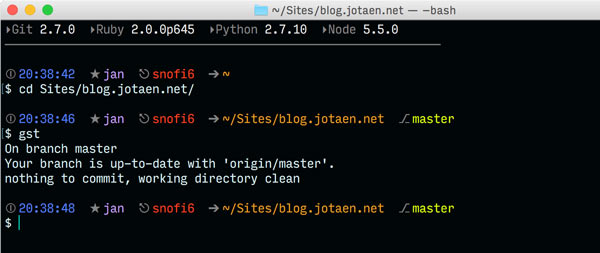

+++
title = "Spread your configuration"
subtitle = "Syncing dotfiles with git"
date = "2016-02-07"
tags = ["tooling"]
image = "mac-with-stickers.jpg"
id = "2uNLp"
url = "2uNLp/syncing-dotfiles-with-git"
aliases = ["2uNLp"]
+++

There are more than 60,000 dotfile repos on Github. Perhaps there are also as many approaches to install or bootstrap or setup them. I found a plain and simple way for myself to version and share my config files between multiple computers: — drum roll… — git! This is a passive approach though, since it doesn’t install any software or tools, it just syncs dump files between your various machines.

There are only few things to know in order to get started, so within 5 minutes you should be ready to go. This blogpost tells you what to do.

## Whitelisting with .gitignore

After you have initialized git in your home folder, the first thing you do is creating a `.gitignore` file, since you cannot track the folder in its entirety – you likely want to commit particular files and folders. Unfortunately, git doesn’t support whitelisting natively. However, there is a workaround by blacklisting (i.e. ignoring) everything and then in turn unignoring the files and folders you wish to check in.

```Bash
# First, ignore everything:
*

# Now unignore specific files:
!/.gitignore
!/.gitignore_global
!/.bash
!/.bash_profile
```

If you want to version files within subfolders or even complete subfolders, things turn out to be a bit tricky. Let’s say, you want to commit your custom keyboard layouts (that I showed in a [previous blogpost](/4haPC/stop-using-ascii-art)), that live in `~/Library/Keyboard Layouts/`. The following notation would be the correct way to put into `.gitignore`:

```Bash
# 1. Re-ignore subdirectory (WITH trailing slash)
/Library/
# 2. Unignore the desired folder (WITHOUT trailing slash)
!/Library/Keyboard Layouts
```

You literally have to work your way down to the target:

1. At first, re-ignore the subdirectory, where the desired files or folders are located (don’t ask…). It’s absolutely crucial to provide a trailing slash here, otherwise it won’t work! (Again, don’t ask)
2. Then, unignore the specific files or folders, you wish to keep track of. When it’s a folder that you want to commit, you have to omit the trailing slash.

## Setting up git

Your entire home folder (with every subfolder in it) is a repo now – of course this would be annoying. Thankfully, there is a pragmatic solution for that: Just create a bash alias, that let’s you easily “switch git on and off”:

```Bash
alias git-disable="mv .git ._git"
alias git-enable="mv ._git .git"
```

# Instruction manual

TLDR; In brief: follow these steps to add a config file/folder:

1. Go to your home folder
2. Run `git-enable`
3. Unignore the files or folders in your `.gitignore`
4. Remember the subfolder notation and beware of trailing slashes!
5. Commit and push
6. Run `git-disable` to hide the repo

That way, where-ever you are, you may enjoy your lovely colored bash profile, which you created on a drizzly Sunday evening…


