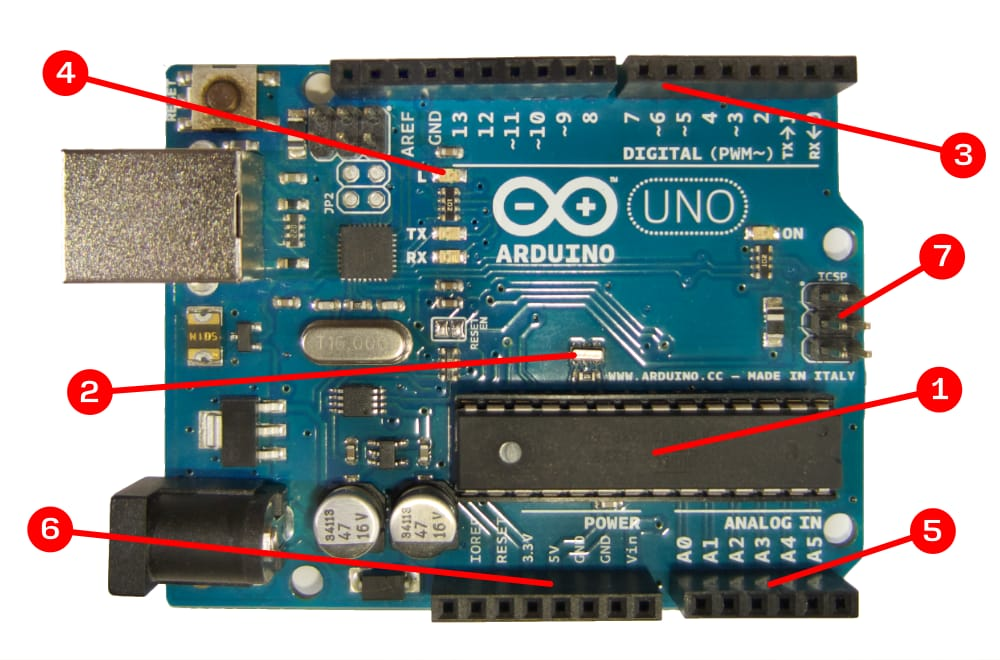
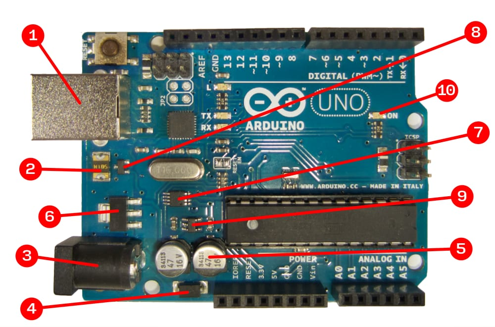
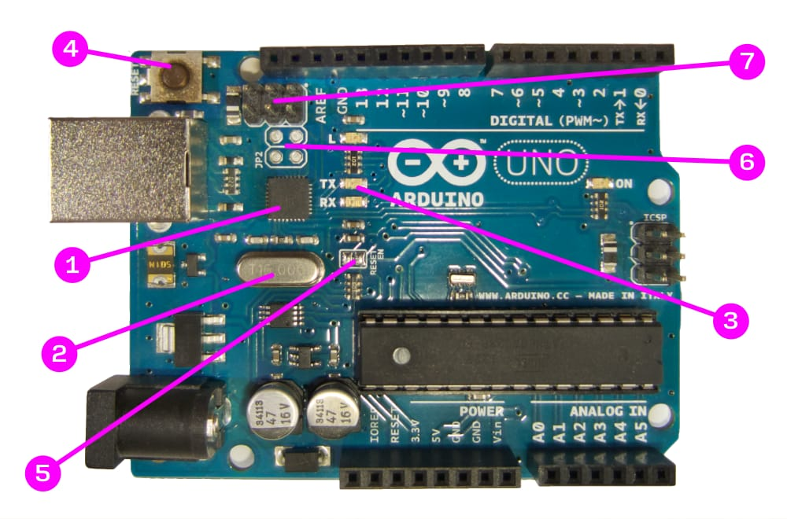
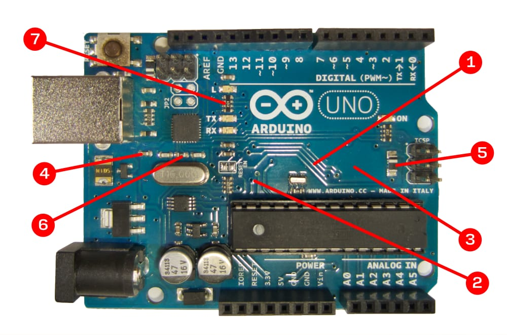

+++
title = "Arduino flightseeing"
subtitle = "An explanation of the Arduino Uno hardware components"
date = "2019-11-30"
tags = ["hardware"]
image = "arduino.jpg"
image_colouring = 40
image_info = ""
id = "iJ6fF"
url = "iJ6fF/arduino-hardware-components-explained"
aliases = ["iJ6fF"]
+++

One magnificent thing about Arduino is how easy it is to get started. You neither need to know something about the innards of microcontrollers nor do you need any special equipment. Instead, you connect the Arduino to a computer via USB and upload a simple sketch-file with the Arduino IDE – and voilà, the onboard LED starts to flash.

If you inspect your Arduino board closer, however, it becomes clear that there apparently is some “stuff” needed to make all of this convenience happen. And in case you have no (or little) idea what you see there and what the single components are there for, this blog post will go through them one after the other.

A few miscellaneous remarks, before we start:

- For this post I used the Arduino Uno rev3 with an AVR ATmega328P chip. There exist variations of this model, other models (like the Arduino Mega or the Arduino Nano) will look vastly different. However, you still should be able to spot differences and similarities, since most of the boards follow the same basic ideas and patterns.
- I roughly devided the board into 4 sections: the main microcontroller unit, the power supply, the controlling unit and eventually generic components and wiring. These categories, however, are not “official”, so you won’t find these terms consistently everywhere.
- For what it’s worth, the back-side of the board isn’t all that interesting. In case you want to see it though, I provided you a [picture of it here](arduino-backside.jpg).

# Main microcontroller

The 1 ATmega328P microcontroller is the heart of the Arduino Uno. It is a fully self-contained mini computer that provides - among others – the following functionalities:

- Computing unit (CPU and ALU) for executing programs and processing data
- Volatile memory (2 Kb) to hold program and data during runtime
- Permanent storage for saving programs (up to 32 Kb) or data (up to 1 Kb) enduringly[^1]
- An RC oscillator (8 MHz) for clocking
- Electrical input and output ports, both digital and analog
- A serial interface for incoming and outgoing communication

As you can see, when we are speaking about the core functions of the Arduino we are actually referring to genuinely provided capabilities of the ATmega328P microcontroller. And indeed, all the pins described below are directly wired to the ports of the ATmega328P. There is only one external device involved: a 2 16 MHz ceramic resonator, which is not just twice as fast than the build-in one but also more precise.

The array of 3 14 digital pins can be used as input or output for binary signals. Some of the pins are prefixed with a `~` sign to indicate that they can also act as analog output. These are technically still digital pins though, because the analog signal is created by a mechanism called “pulse-width modulation”. The respective pins are associatetd with timers that can toggle the binary signal in rapid succession, thereby creating a quasi-analog signal determined by the ratio between on-time and off-time. Pin 0 and 1 serve a double-purpose, they also handle serial data reception (RX) and transmission (TX). Pin 13 is wired to the 4 onboard LED.

Six 5 Analog Input Pins can convert analog input signals to discrete integer values. The ATmega328P contains one analog-digital-converter for that purpose, which is shared across all those pins. The conversion process is relatively slow and takes around 0.1 ms, which makes for a overall maximum of about 10.000 AD-conversions per second (10 kHz). The analog input pins can also be used as ordinary digital pins.

Apart from the I/O pins there are a bunch of 6 pins for receiving power from or providing it to the outside, or for setting reference voltages. The two leftmost pins in the upper pin array are for connecting periphals via the I²C Bus (labelled SDA and SCL on the back-side). And finally the leftmost pin in the lower pin array is blind and not connected to anything.

A 7 6-pin male connector nearby the ATmega328P chip provides an ISCP interface that can be used to transfer programs to the microcontroller via an external programming device. You’ll find yet another ISCP connector on the board, which we’ll cover later, since it’s not related to the ATmega328P chip.

# Power supply

The power supply section of the Arduino board is a sophisticated (read: well thought out) circuitry whose job is to ensure that a stable current is supplied to the board. You can think of it as an antechamber, where incoming current is regulated and stabilised before it is fed into the board’s 5V power supplies. The components of microcontroller-based circuits are quite sensitive in regards to electricity: ups and downs of the current could cause random malfunctions, undervoltage might bring the board to a halt, and overvoltage can cause severe damage that might be hard or impossible to repair. Hence, it is utterly important to have well-regulated 5V flowing within the power supplies.

Arduino is able to draw power from various sources. The most obvious one is the 1 USB Socket, which is supposed to provide 5V according to the USB standard. This happens to presicely match the demand of the ATmega328P chip and can thus be used as is. Only a 2 fuse was added to prevent damage to the board and the connected host computer from electrical overload, potentially caused by connected components consuming too much energy.

Another way of supplying power is via the 3 coaxial power connector (or: barrel connector). Incoming current first passes a 4 diode, which only allows current to flow into one direction. (This is a safety measure against coaxial connectors with wrong polarity.) The current is buffered in two big 5 capacitators that absorb electrical fluctuations in order to stabilize the power supply. Next, the big 6 voltage regulator converts the input current from a maximum of 20V down to a steady 5V output that is then eventually fed into the board’s power supplies. The regulator will produce a considerable amount of heat though, depending on how close you get to the allowed input maximum.

The power lines of both described sources are connected to a 7 dual-operational amplifier[^2]. It decides which of the two sources shall be drawn from and toggles a 8 transistor accordingly. (A transistor basically is an electrically controlled switch.) 

Apart from all that, there is also the option to provide power through either the Vin-Pin or the 5V Pin. In the first case, current takes the same path as described for the coaxial connector with the exception of the diode, which is not passed. In the second case, power is fed right into the board’s power supplies without any further ado and therefor required to be regulated externally.

Lastly, there is another smaller 9 voltage regulator that reduces the regulated 5V down to 3.3V and forwards it to the 3.3V power Pin. And then there is the 10 Power-LED, which is wired directly to 5V and thus will light up whenever current is available in the board’s power supplies. Consequently, if it doesn’t shine, there is either no power at all or the LED is broken.

# The controlling unit

Arduino offers a very convenient way to load sketches from your computer onto the board via USB. Apart from the Arduino IDE (or some equivalent software tool) there are several hardware components in place to make this happen. For one, there is yet another fully fledged 1 microcontroller mounted, an ATmega16U2. It’s main responsibilities are to forward new sketches to the ATmega328P and to take care of the serial communication via USB to the host computer. Since USB has high demands in terms of clock precision, there is a dedicated 2 16 MHz quartz crystal connected. (Which is not wired to the ATmega328P, by the way, as one could easily suppose!) The ATmega16U2 is connected via the TX and RX ports to the ATmega328P. The latter has a special bootloading sequence preinstalled that takes care of receiving newly available sketches from the former. The 3 TX and RX LEDs flash to indicate that there is serial communication going on.

There are multiple ways to restart the Arduino, the easiest of which is to press the onboard 4 reset button. Unlike previous versions of the Arduino Uno, you don’t have to manually reset it after uploading a new sketch anymore, the ATmega16U2 issues a reset signal automatically after every upload. If you want, you can prevent that from happening by physically cutting out the metal in the 5 “reset-enable” jumper, which effectively interrupts the signal coming from both the reset button and the ATmega16U2.

An interesting option for expert users might be to connect something to the 6 JP2 jumpers. These are directly wired to four unoccupied input channels on the ATmega16U2, which are free to use. That, however, would necessarily imply to manually upload a program via the 7 ISCP connector of the ATmega16U2.

# Wiring

Now that we have an understanding of the individual components, let’s have a look at how everything plays together. There aren’t any wires on the board, electricity rather flows through 1 conductive traces. The Arduino Uno is a so-called printed circuit board (PCB), which means that there is a conducting layer on the top and on the bottom of the board. During the manufacturing process a layout of traces and areas (think: roads and places) is printed onto the surfaces, which are then treated with acid. That way the non-printed surface sections vanish and distinct electrical pathways remain. On the top-side all the lighter colours are conductive, whereas the darker ones are non-conductive. On the bottom-side it’s the greyish colours that conduct, while white is isolating. The numerous 2 little holes are called “vias” and act as loopholes bridging over from one side to the other. This, by the way, is the only way to avoid unwanted intersections between traces. The 3 conductive areas on both sides conduct ground voltage (GND) for the greater part.

Upon closer look you see some smaller surface-mounted devices (SMD) here and there:

- 4 Capacitators are mostly used for decoupling (read: smoothening) the current flow. The clock-speed of 16 MhZ would otherwise be enough to introduce a lot of noise and thus cause erratic behaviour.
- 5 Diodes are there to ensure the direction of current and to prevent potential damage by reverse polarisation induced from the outside.
- 6 Resistors are limiting the amount of current that can pass. They also appear bundled as 7 resistor networks for space-efficiency.

# Conclusion

And that’s it. Apart from the preinstalled bootloader on the ATmega328P and the special program on the ATmega16U2, all the described components are standard and “off-the-shelf”. And infact, you can build up your own Arduino from the ground up all by yourself. In case you are interested to dive deeper, here are some further resources:

- [Electrical schematics](https://content.arduino.cc/assets/UNO-TH_Rev3e_sch.pdf) of the Arduino Uno
- [Arduino source code repository](https://github.com/arduino/Arduino)
- Comprehensive [ATmega328P datasheet](http://ww1.microchip.com/downloads/en/DeviceDoc/ATmega48A-PA-88A-PA-168A-PA-328-P-DS-DS40002061A.pdf)

[^1]: Like all AVR chips, the ATmega328P has modified harvard architecture, where program and data are stored in separate physical memory systems.

[^2]: The dual-op amplifier looks a bit like a microcontroller, but it actually “only” contains an analog comparator for controlling the transistor.
